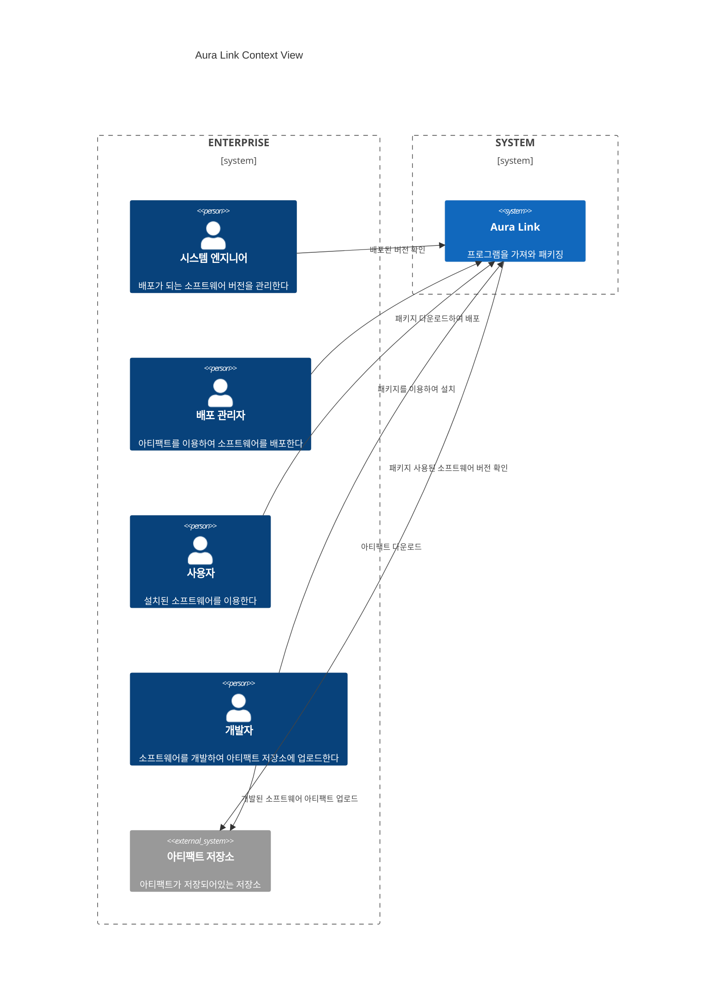
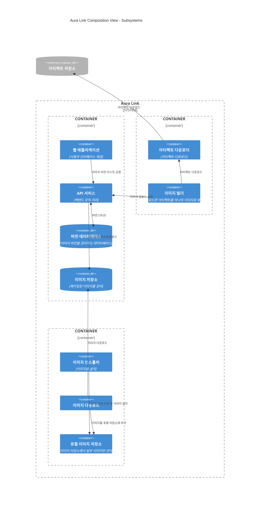

# AuraLink Software Design Description

- [AuraLink Software Design Description](#auralink-software-design-description)
  - [Stakeholders \& Concerns](#stakeholders--concerns)
  - [Context](#context)
    - [Viewpoint](#viewpoint)
    - [View](#view)
  - [Composition](#composition)
    - [Viewpoint](#viewpoint-1)
    - [View](#view-1)

## Stakeholders & Concerns
| 직군 | 관심사 |
| -- | -- |
| 시스템 엔지니어 | 버전 관리 |
| 개발자 | 버전 관리 배포 절차 |
| 배포 관리자 | 버전 관리 배포 절차 데이터 저장 및 관리 시스템 내부 구조 |
| 사용자 | 버전 관리 설치 절차 |

## Context
### Viewpoint
#### Purpose
AuraLink 시스템의 전체적인 시스템 구조를 파악하기 위한 Viewpoint
#### Element
Context Viewpoint의 구성 요소
##### Entities
* Actor  
    * 시스템 엔지니어
    * 개발자
    * 배포 관리자
    * 사용자
    * 아티팩트 저장소
    
* Service
    * 개발자는 소프트웨어를 개발하여 아티팩트 저장소에 업로드한다.
    * 시스템 엔지니어는 패키징된 소프트웨어의 버전을 확인한다.
    * 사용자는 패키지 버전을 선택하여 설치한다.

##### Relations
* 개발자는 패키징할 소프트웨어 설정을 입력한다.
* 시스템 엔지니어는 패키징되어있는 소프트웨어 버전을 확인한다.
* 사용자는 패키징되어있는 소프트웨어 버전 목록을 확인한다.
* 사용자는 패키징되어있는 소프트웨어를 다운로드 받는다.
#### Language
* C4 Diagram - Level 1
### View

## Composition
### Viewpoint
#### Purpose
AuraLink 시스템의 구성을 이해하기 위한 Viewpoint
#### Element
##### Entities

* Subsystem
  * 
##### Relations
#### Language
* C4 Diagram - Level 2
### View
